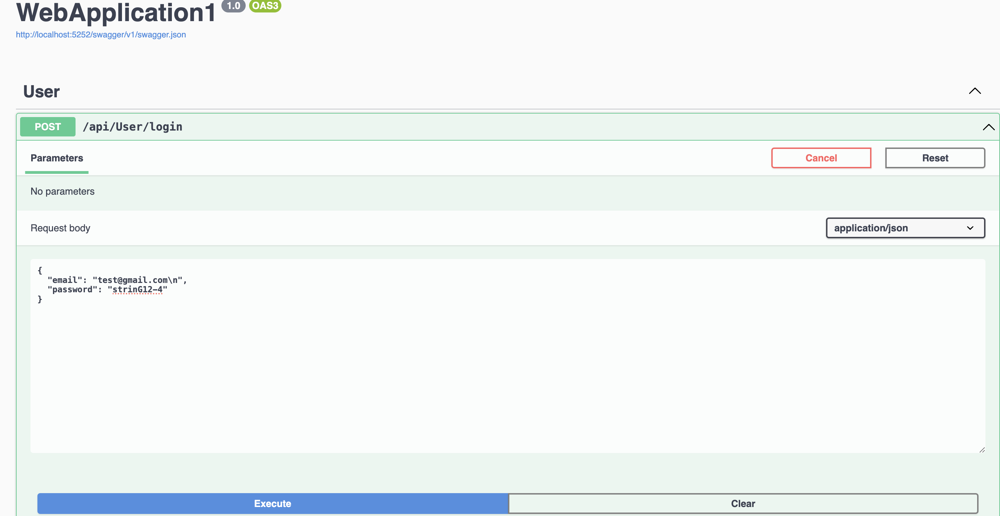
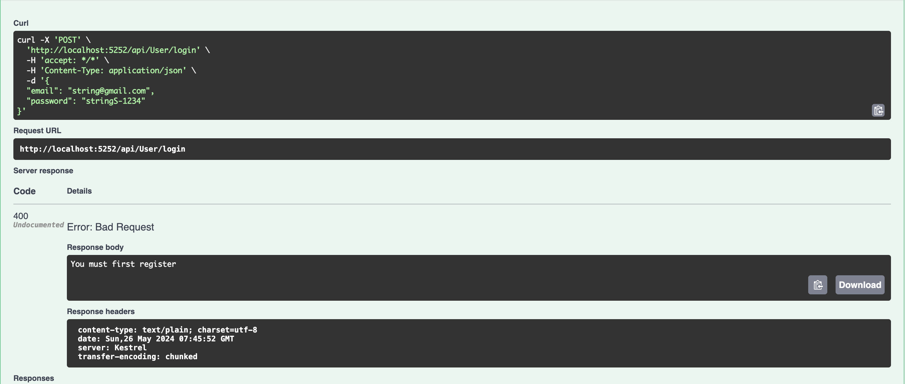
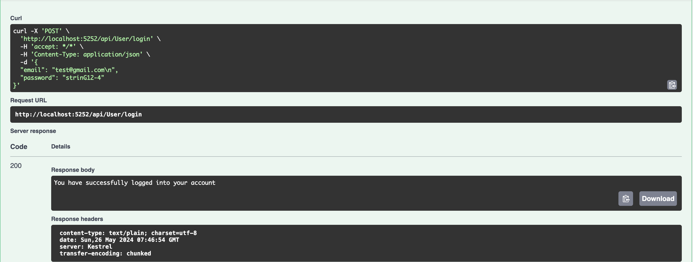
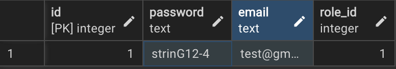
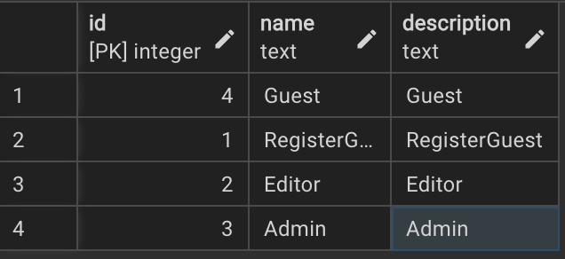

# Тестування працездатності системи  
Тестування відбувалось за допомогою Swagger  

## Авторизація користувача

### Початкове вікно авторизації

### Введення даних

### Помилка

### Успішна авторизація

## Вигляд даних у базі даних

